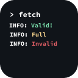

<div align="center">
    
    <h1>Testflight Checker</h1>
    <p>Simple & Easy script to check testflight links with some spices</p>
    <hr />
</div>

> **Warning**
> This software is WIP (Working in progress)

## Dependencies
- ``python``
- ``colorama``
- ``requests``
- ``typer``
- ``beautifulsoup4``

## Installation
(WIP)

## Usage
```
-a --amount int | Set how many times send request (Default: 1)
-i --interval int | Set interval (Default: 1)
-u --url str | Set target url (Default: None)
```

Example:
```python3 check.py -a 3 -i 5 -u https://testflight.apple.com/join/ABCD123```